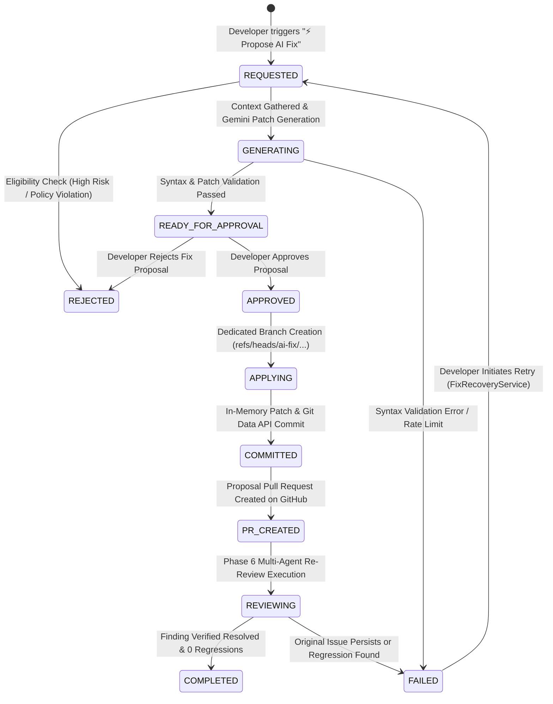

# Phase 8 — AI Code Fix & Auto-Remediation System Guide

## Executive Summary

Phase 8 introduces an automated, human-governed **AI Code Fix & Auto-Remediation System** for the Automated Code Review platform. It allows developers to propose, preview, approve, and safely publish AI-generated unified diff code fixes for review findings detected during Phase 6 multi-agent code reviews.

The architecture enforces strict safety guarantees:
- **Human Approval Mandate**: AI fixes default to **PREVIEW ONLY**. No code is ever pushed or pull-requested without explicit human developer approval.
- **Zero Host Disk Writes**: Patches are applied in memory and committed directly via the low-level GitHub REST & Git Data APIs.
- **Protected Branch Guard**: Direct commits or force-pushes to protected branches (`main`, `master`, `develop`) are strictly forbidden.
- **Post-Fix Verification**: Fixes are only marked `COMPLETED` after Phase 6 multi-agent reviews re-evaluate the post-fix code and confirm the original finding is resolved without introducing regressions.

---

## Architectural Workflow & State Machine

---

## Complete 28-Stage Architecture Map

| Stage | Component / File | Description |
|---|---|---|
| **8.1** | `app/fixes/models.py` | State enums (`FixStatus`), `FixRequest`, `FixPatch`, `FixResult`, `FixAnalyticsMetrics` DTOs |
| **8.2** | `app/fixes/fix_request_service.py` | `FixRequestService` for creating and managing fix proposals |
| **8.3** | `app/fixes/fix_eligibility_service.py` | Safety policy evaluating risk levels (`LOW`, `MEDIUM`, `HIGH`, `CRITICAL`) |
| **8.4** | `app/fixes/fix_context_builder.py` | Minimal context gatherer (target file excerpt, line window, issue description) |
| **8.5** | `app/fixes/fix_generator.py` | Gemini 1.5 Pro prompt formatting and unified diff patch generation |
| **8.6** | `app/fixes/patch_validator.py` | Multi-check dry-run validator (paths, size limits, hunk headers, SHA integrity) |
| **8.7** | `app/validation/syntax_validator.py` | Multi-language AST syntax validator (Python `ast`, JSON `json`, JS/TS bracket stack) |
| **8.8** | `app/fixes/fix_service.py` | Orchestration engine coordinating request, generation, validation, and stores |
| **8.9** | `app/fixes/approval_service.py` | Human-in-the-loop approval service enforcing state guards and audit logs |
| **8.10** | `app/fixes/branch_service.py` | Safe branch manager creating `ai-fix/{id}` refs off `base_commit_sha` |
| **8.11** | `app/fixes/patch_applier.py` | `InMemoryPatchService` applying GNU unified diffs in memory (0 host disk writes) |
| **8.12** | `app/github/github_fix_service.py` | High-level GitHub REST service wrapping Git Data API blobs, trees, commits, PRs |
| **8.13** | `app/fixes/commit_service.py` | `CommitService` creating Git Data API blobs/trees/commits and updating branch HEAD |
| **8.14** | `app/fixes/fix_pr_service.py` | Proposals PR service appending Governance & Safety Notices to pull requests |
| **8.15** | `app/fixes/post_fix_review_service.py` | `PostFixReviewService` re-running Phase 6 multi-agent review on patched code |
| **8.16** | `app/fixes/verification_service.py` | Verification engine checking original issue resolution and regression detection |
| **8.17** | `app/db/fix_repository.py` | MongoDB repository providing CRUD persistence for requests, patches, and results |
| **8.18** | `app/fixes/analytics_service.py` | Operational analytics engine calculating acceptance rate and verification success |
| **8.19** | `src/components/fixes/FixPreviewModal.tsx` | Frontend proposal modal displaying risk badges, patch explanations, and actions |
| **8.20** | `src/components/fixes/DiffViewer.tsx` | Interactive unified and split diff viewer component |
| **8.21** | `src/components/fixes/FixStatusBadge.tsx` | Contextual status badges and "⚡ Propose AI Fix" issue card triggers |
| **8.22** | `src/components/fixes/FixHistoryDashboard.tsx` | Analytics dashboard displaying KPIs, acceptance charts, and request history |
| **8.23** | `app/fixes/security_service.py` | Secret masking (`ghp_`, `AIzaSy`, `sk-`), path traversal, and branch guards |
| **8.24** | `app/fixes/rate_limiter.py` | Sliding window rate limiter (max 5 req/min) and concurrency throttling |
| **8.25** | `app/fixes/recovery_service.py` | Failure audit recording, stale branch detection, and developer retry workflow |
| **8.26** | `tests/fixes/test_phase8_e2e_integration.py` | End-to-end integration test suite covering happy paths and failure scenarios |
| **8.27** | `app/fixes/observability.py` | Telemetry logger (`FixTelemetryLogger`) and metric collector (`FixMetricsCollector`) |
| **8.28** | `docs/PHASE8_AI_CODE_FIX_GUIDE.md` | Comprehensive system architecture and developer reference guide |

---

## API Reference

### 1. Create Fix Request
`POST /api/fixes/request`
- **Body**: `{"review_id": "string", "issue_id": "string"}`
- **Response**: `FixRequest` model in `REQUESTED` state.

### 2. Generate Fix Preview
`POST /api/fixes/{fix_request_id}/preview`
- **Response**: `FixPreviewResult` containing generated `FixPatch`, risk evaluation, and syntax validation status.

### 3. Approve Fix Proposal
`POST /api/fixes/{fix_request_id}/approve`
- **Body**: `{"note": "Optional approval comment"}`
- **Response**: `ApprovalResult` advancing request state to `APPROVED`.

### 4. Apply & Commit Fix
`POST /api/fixes/{fix_request_id}/apply`
- **Response**: `CommitResult` with created Git commit SHA and dedicated branch ref `ai-fix/...`.

### 5. Publish Fix Pull Request
`POST /api/fixes/{fix_request_id}/create-pr`
- **Response**: `FixPRResult` containing created GitHub PR number and HTML URL.

### 6. Get Operational Analytics
`GET /api/fixes/analytics`
- **Response**: `FixAnalyticsMetrics` containing `total_fix_requests`, `status_counts`, `acceptance_rate`, and `verification_success_rate`.

---

## Safety & Governance Invariants

1. **Explicit Developer Approval**: AI-generated patches remain in `PREVIEW_ONLY` mode until human approval is recorded in `ApprovalService`.
2. **Secret Masking**: All LLM prompts, log outputs, and telemetry events are passed through `FixSecurityService.sanitize_llm_prompt()`.
3. **No Force Pushing**: `update_ref(force=False)` is strictly enforced in `GitHubFixService`.
4. **No Autonomous Merging**: Generated Pull Requests include explicit governance headers prohibiting self-merging.
